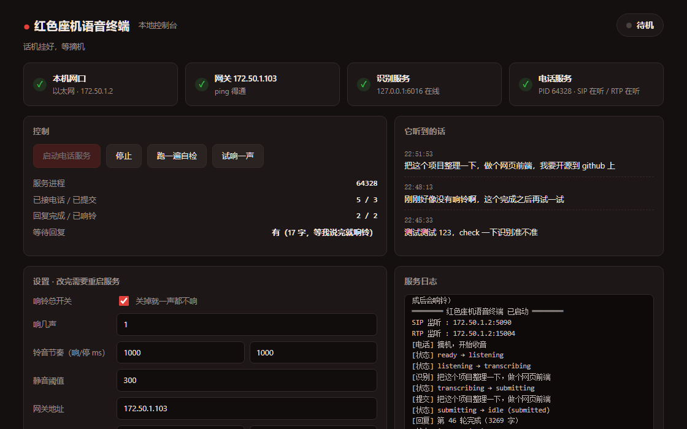

# 红色座机 · 给 AI 装一部电话

**把一台老式模拟电话机接给 AI 编程助手——摘机说话，它干完活会打回来。**

> 一个把上世纪的话机接进本世纪 AI 工作流的小项目。
> 全本地运行，不依赖任何云端语音服务。



**自带一个本地网页控制台**：看服务状态、看它听到的话、启停服务、试响一声、改设置。
零依赖 —— 只用 Node 内置模块，`node web/server.mjs` 就能开，不装任何前端框架。

```bash
cd 源码/phone-companion
cp phone.config.example.json phone.config.json   # 然后改里面的 workspace
node web/server.mjs                              # 打开 http://127.0.0.1:8932
```

**目录**

- [一、它解决什么问题](#一它解决什么问题) · [二、为什么不用现成方案](#二为什么不用现成方案) · [三、系统架构](#三系统架构)
- [四、硬件清单](#四硬件清单) · [五、软件组成](#五软件组成)
- [六、想深入？技术细节在另外两份文档里](#六想深入技术细节在另外两份文档里)
- **[七、快速开始](#七快速开始)** ← 想直接动手看这节
- [八、已知限制](#八已知限制) · [九、路线图](#九路线图) · [十一、关于这个项目](#十一关于这个项目)

---

## 目录结构

```
.
├── README.md                    你正在看的这份 —— 只有"有什么用、怎么跑起来"
├── LICENSE
├── 源码/phone-companion/        ★ 可运行的全部代码
│   ├── src/                     8 个核心模块（音频/SIP/状态机/会话监听/注入/识别…）
│   ├── web/                     本地网页控制台（零依赖）
│   ├── 工具/                     验证、诊断、网关配置、调试脚本
│   ├── 产物/缓存音频/            预渲染的提示音（μ-law 裸数据）
│   ├── ht801.py                 网关配置工具（inspect / configure / set / restore）
│   ├── 启动.mjs                  一键启动器
│   └── phone.config.example.json 配置模板
├── 工具/                        网卡修复脚本（USB 网卡拔插后丢静态 IP 时用）
└── docs/                        ← 想深入了解看这里
    ├── 技术细节.md               ★ 核心工程问题与设计取舍
    ├── 开发历程与踩坑记录.md       ★ 真机上踩过的每一个坑
    ├── 项目简述.md               一句话版本 + 和"语音助手"的区别
    ├── TTS选型调研-留档.md        被放弃的听筒播报，替代方案都在这里
    ├── 控制台截图.png
    └── 历史方案/                 开工前的调研与方案比选（含被否掉的路线）
```

> 第三方组件**不随仓库分发**：识别引擎（CapsWriter-Offline）请自行 clone，见"快速开始"。
> 本项目的 SIP/音频/状态机全部是自己实现的，参考实现（codex-redline）的代码一行都没有复制。

---

## 一、它解决什么问题

### 动机

用 AI 编程助手的人都会遇到一个尴尬：**你被绑在键盘前。**

想交代一件事，得先把手从别处挪开、切回窗口、敲字、发送。对于"临时想到一句"的场景，
这个动作链条太长——尤其是在你手上正拿着相机、拿着工具、或者刚躺下的时候。

**我们不想再造一个语音助手 App，而是想让"说话"这件事有个物理载体。**

### 为什么是电话

电话天然满足三个条件：

1. **拿起就能说** —— 摘机是一个不可误触的物理动作，比"嘿，某某"这类唤醒词可靠得多
2. **放下就结束** —— 挂机是明确的"我说完了"信号，不需要你按任何按钮
3. **它天生就是双向的** —— 有听筒能听、有话筒能说、还能响铃

第 3 条尤其关键：**普通麦克风只能输入，而电话能主动找你。**
这正是这个项目最核心的设计：**AI 干完活，电话响铃把你叫回来。**

### 最终形态

```
你拿起听筒          →  听到一声"嘀"（可以说了）
你对着它说话        →  本地实时转成文字
你放下听筒          →  文字自动提交给 AI 助手
AI 开始干活         →  你可以离开去干别的
AI 干完了           →  电话响铃 —— 回来看看结果
```

---

## 二、为什么不用现成方案

| 现成方案 | 为什么不用 |
|---|---|
| 智能音箱 | 需要唤醒词、依赖云端、不能"挂机提交"、更不会主动响铃叫你 |
| 手机语音输入法 | 结果直接注入焦点窗口，程序拿不到文本流；且依赖手机在线 |
| 云端语音 API | 说话内容要上传；有月费；离线不可用 |
| USB 麦克风 | 只能输入，不能主动通知；"开始/结束"要靠按键 |

**这个项目的取舍是：用最土的硬件（模拟话机），换最硬的体验（物理动作即交互）。**

---

## 三、系统架构

```
┌─────────────┐  RJ11   ┌──────────────┐   SIP/RTP    ┌──────────────────────────┐
│  红色座机    │◄───────►│  FXS 语音网关  │◄───────────►│  电脑（本机服务）          │
│             │  馈电     │ (模拟电话转IP) │   以太网      │                          │
└─────────────┘  铃流     └──────────────┘             │  ┌────────────────────┐  │
                                                       │  │ 电话服务             │  │
                                                       │  │ · SIP 信令 :5090    │  │
                                                       │  │ · RTP 音频 :15004   │  │
                                                       │  │ · G.711 μ-law 编解码 │  │
                                                       │  │ · 状态机/提示音/回铃  │  │
                                                       │  └──┬──────────┬───────┘  │
                                                       │     │          │          │
                                                       │  16k PCM     文字        │
                                                       │     ▼          ▼          │
                                                       │  ┌────────┐ ┌──────────┐  │
                                                       │  │本地识别 │ │ 注入输入框│  │
                                                       │  │(离线ASR)│ │ 并提交    │  │
                                                       │  └────────┘ └────┬─────┘  │
                                                       │                  ▼        │
                                                       │            AI 助手处理      │
                                                       │                  │        │
                                                       │        回复完成 │        │
                                                       │        ┌─────────┘        │
                                                       │        ▼                  │
                                                       │  ┌──────────────────┐     │
                                                       │  │ 会话监听器         │     │
                                                       │  │ 检测"这轮说完了"   │     │
                                                       │  └────────┬─────────┘     │
                                                       └───────────┼───────────────┘
                                                                   ▼
                                                          主动呼叫 → 电话响铃
```

### 关键设计决策

| 决策 | 原因 |
|---|---|
| **用 FXS 网关而不是"听筒直连声卡"** | 只有网关能给话机提供 **48V 馈电**（否则听筒是死的）、**真拨号音**、**20–25Hz 铃流**（否则不会响铃）。听筒直连声卡只能当麦克风用，铃永远不会响 |
| **音频走 SIP/RTP 而不是 USB 声卡** | 换电脑不用重新接线；网关自己就是电话系统，语义完整 |
| **识别与合成全部本地** | 不需要为说一句话付费，不需要联网，说话内容不出本机 |
| **"回复完成"靠监听会话文件，而不是 Hook** | 当前 AI 助手没有提供可用的 Stop Hook；只读监听会话是唯一不侵入的方案 |

---

## 四、硬件清单

只需三样东西：**一部话机、一个网关、一根网线**。

| 件 | 选型 | 挑选要点 |
|---|---|---|
| 红色座机 | 中诺（CHINO-E）**C289** 红色 | 听筒线要 **4 芯可拔插**（4P4C/RJ9）；**必须选现代机型**——驻极体话筒可直接工作，80 年代老机的碳精话筒需要改电路 |
| FXS 语音网关 | **Grandstream HT801**（中文名"潮流"） | 把模拟话机变成标准 SIP 网络电话。**必须是 FXS 口**（接话机），不是 FXO（接外线）。双口型号 HT802 可再接一部电话 |
| USB 网卡 | 任意 USB 千兆网卡 | 给网关单独一个隔离网段（可选——直接接到路由器也能跑，但会占用一个 LAN 口） |
| 网线 | 普通网线 | 网关 ↔ 电脑 |

> **网关怎么选**：任何支持标准 SIP 的 **FXS** 网关都行，不限于 HT801。
> 关键是这三项必须能配：**摘机自动拨号**（Off Hook Auto Dial）、**可调铃流节奏**、**G.711 编码**。
> 具体怎么配见 [快速开始](#七快速开始) 第 5 步。

**接线只需三步**：

```
红色座机 ──RJ11 电话线──► 网关 PHONE 1 口
电脑 USB 网卡 ──网线────► 网关 LAN 口
网关 ──电源适配器──────► 插座（必须独立供电）
```

> **为什么不能"只听筒直连声卡"**：话机需要网关提供 **48V 馈电**（否则听筒完全静音）
> 和 **20–25Hz 铃流**（否则永远不会响铃）。这是本项目必须用 FXS 网关的原因——
> 也正是"AI 干完活能打电话叫你"这个核心体验的前提。

---

## 五、软件组成

纯 Node.js（服务）+ Python（识别引擎）+ PowerShell（窗口注入），无重依赖。

| 模块 | 职责 | 行数 |
|---|---|---|
| **音频地基** | G.711 μ-law 编解码、RTP 打包/解析、采样率转换、提示音生成 | ~250 |
| **SIP/RTP 终端** | 来电应答、主动呼叫（回铃）、DTMF 收号、SDP 协商、双向音频 | ~500 |
| **本地识别客户端** | 电话音频 → 文字（走本地离线识别引擎的 WebSocket 协议） | ~230 |
| **电话状态机** | 摘机→就绪音→收音→挂机→识别→提交→回铃 全流程 | ~380 |
| **会话监听器** | 只读监听 AI 助手的会话文件，检测"这一轮回复完成" | ~300 |
| **文字注入** | 把识别结果送进输入框并提交（窗口聚焦 + 剪贴板粘贴） | ~180 |
| **装配入口** | 把上述模块接成可跑服务，含自检/状态/模拟来电 | ~480 |
| **网关配置脚本** | 一键配置网关并支持回滚 | ~180 |

---

## 六、想深入？技术细节在另外两份文档里

这份 README 只讲"这项目有什么用、怎么跑起来"。真正有技术含量的部分拆成了两份：

| 文档 | 内容 | 适合谁 |
|---|---|---|
| **[技术细节](docs/技术细节.md)** | 8 个核心工程问题的来龙去脉：G.711 μ-law 为何没有唯一标准表、`Buffer.from` 的隐藏陷阱、多 frame zstd 怎么解、如何可靠判定"这一轮说完了"、GUI 注入的两个坑、被放弃的 TTS… | 想复刻一套，或好奇"为什么非得这么做" |
| **[开发历程与踩坑记录](docs/开发历程与踩坑记录.md)** | 真机上踩过的每一个坑：症状 → 根因 → 修法。**大多属于"不报错但行为全错"的静默故障** | 卡在某个具体问题上、或在做类似项目 |

---

## 七、快速开始

需要 **Node ≥ 20**、**Python 3.10+**（只用来配网关），以及一台装好 DSH 的 Windows 机器。

### 1. 接线

```
座机 ──RJ11 电话线──► HT801 的 PHONE 1
HT801 ──网线───────► 电脑的**第二个网口**（建议用 USB 网卡，别占用上网那张）
HT801 ──电源───────► 插座（必须独立供电，它要给话机提供馈电和铃流）
```

### 2. 给那个网口配静态 IP

网关出厂是自己一个网段（常见 `192.168.1.1`），所以电脑那个网口也要在同网段。
Windows：`ncpa.cpl` → 选接网关的那张网卡 → IPv4 → 手动 → 例如 `192.168.1.2 / 255.255.255.0`。

> USB 网卡**拔插后会丢静态 IP**（Windows 会当成新设备重新枚举），症状是网关 ping 不通。
> `工具/` 里有现成的一键修复脚本。

### 3. 准备识别服务

识别用的是 [CapsWriter-Offline](https://github.com/HaujetZhao/CapsWriter-Offline)（本地离线，含 SenseVoice 模型）。
自行 clone 到 `源码/CapsWriter-Offline/`，按它的说明建好 `.venv` 并启动，确认 `127.0.0.1:6016` 在监听。

### 4. 配好本项目的配置

```bash
cd 源码/phone-companion
cp phone.config.example.json phone.config.json
```

改两个必改项：
- `workspace` → **你的 DSH 工作区根目录**（回铃检测靠它定位会话文件，写错会表现为"电话永远不响"）
- `ataAddress` → 你网关的实际地址

### 5. 配网关

```bash
python ht801.py inspect      # 只读：确认型号、固件、逐项核对参数
python ht801.py configure    # 写入（自动备份原值，可 restore 回滚）
```

### 6. 自检 + 启动

```bash
node src/phone-control.mjs selftest    # 端口 / 识别服务 / 会话定位 / 注入窗口 / 提示音 / 网关
node 启动.mjs                          # 一键拉起识别服务 + 电话服务 + 自检
node web/server.mjs                    # 可选：打开网页控制台 http://127.0.0.1:8932
```

然后**拿起听筒** → 听到就绪音（嘀）→ **等它响完再说话** → 放下 → 文字出现在输入框并提交
→ AI 回复完，**电话响一声通知你**（响几声可在控制台里改，默认 1 声后自动挂断）。


---

## 八、已知限制

| 限制 | 说明 |
|---|---|
| **SIP/RTP 无加密** | 没有 TLS、没有认证、媒体不加密。只应运行在**直连或可信隔离网段**（推荐给网关单独一个网口，不接共享路由器） |
| 仅 Windows（服务端） | 窗口注入依赖 Win32 API；SIP/音频/状态机部分是跨平台的 |
| 仅支持一路电话 | 一个网关一个绑定任务 |
| 依赖 AI 助手的会话文件格式 | 会话是内部格式，助手升级后可能失效（已隔离在单个模块内，便于适配） |
| 不处理助手的权限确认 | 只提交文字，不代替用户批准任何操作 |

---

## 九、路线图

- [x] 音频链路（G.711 / RTP）
- [x] SIP 信令（来电 / 回铃 / DTMF / CANCEL）
- [x] 本地离线识别接入
- [x] 电话状态机（摘机→挂机→提交）
- [x] "回复完成"检测与回铃（**按次数**：响 N 声后自动挂断）
- [x] 不依赖硬件的闭环验证
- [x] 网关配置脚本
- [x] **真机联调**（摘机 / 识别 / 注入 / 回铃，已端到端跑通）
- [x] **本地网页控制台**（零依赖）
- [ ] 听筒播报回复 —— **已明确放弃**：本地 TTS 实测只有 0.31x 实时率，
      架构上慢于实时（16 个码本、每帧串行预测 15 次），不是调参能解决的。
      替代方案见 `docs/TTS选型调研-留档.md`
- [ ] 多路电话 / 外壳改造

---

## 十、开发历程与踩坑

这个项目踩过的坑**比功能还多**，而且大多属于"不报错、但行为全错"的静默故障。
完整记录在 **[docs/开发历程与踩坑记录.md](docs/开发历程与踩坑记录.md)**，其中包括：

- SIP 的 2xx 应答少了 `Contact` 头 → 网关不回 ACK，只听得到忙音
- 通话只靠对端 `BYE` 收尾 → 对端异常消失就永久占线，**之后电话再也不响**
- 没被接听的回铃**从来没发过 CANCEL** → 对端一直振铃、线路一直忙
- 静音时语音识别会**凭空编出一个字**并当成消息提交（已在识别前用电平拦掉）
- 回铃的"哪一轮才算数" —— 一口气修了**四个**同类 bug

---

## 十一、关于这个项目
**它不解决什么大问题。** 它不是效率工具，也不会替代语音助手。

它做的事情很小：**让"跟 AI 说句话"这件事，重新有了拿起和放下的仪式感。**

在一个所有交互都在一块玻璃板上完成的时代，
一个必须**拿起**才能说话、**放下**才算说完、干完活还会**响铃叫你**的东西，
本身就有点好玩。

而且它证明了一件事：**最土的硬件配最硬的技术，可以做出最舒服的体验。**

---

## 十二、致谢

### 思路来源

本项目的**起点是看到有人已经把这件事做成了**：开源项目
**[codex-redline](https://github.com/prikevs/codex-redline)**（MIT）用 Grandstream HT802 把模拟电话
接成了 AI 编程助手的语音终端，摘机说话、挂机提交、完成后响铃。

它证明了这条路走得通，并且公开了最花时间的部分——**网关的全部配置参数**（P 值表）、
**音频参数规格**（G.711 / 8kHz / 20ms 帧 / RFC2833 DTMF）、
以及一批**踩过坑才知道的体验细节**（就绪音频率、回复开头垫静音、响铃次数上限等）。

本项目在其思路基础上做了三处不同的取舍：

| 维度 | codex-redline | 本项目 |
|---|---|---|
| 运行平台 | macOS | Windows |
| 语音识别 / 合成 | 云端 API | **全本地离线** |
| 输入方式 | 系统辅助功能接口 | 窗口聚焦 + 剪贴板注入 |

同时按当前 AI 助手的能力重新设计了"回复完成"的检测方式，并补上了不依赖硬件的闭环验证。

**如果你的环境是 macOS，建议直接使用 codex-redline**——它更完整，且已经跑通实测。

### 其他

音频编解码、SIP/RTP、DTMF 等部分参考了开源社区的通用实现思路，遵守相应开源许可。

---

*本项目全本地运行，语音与文字不出本机。*

